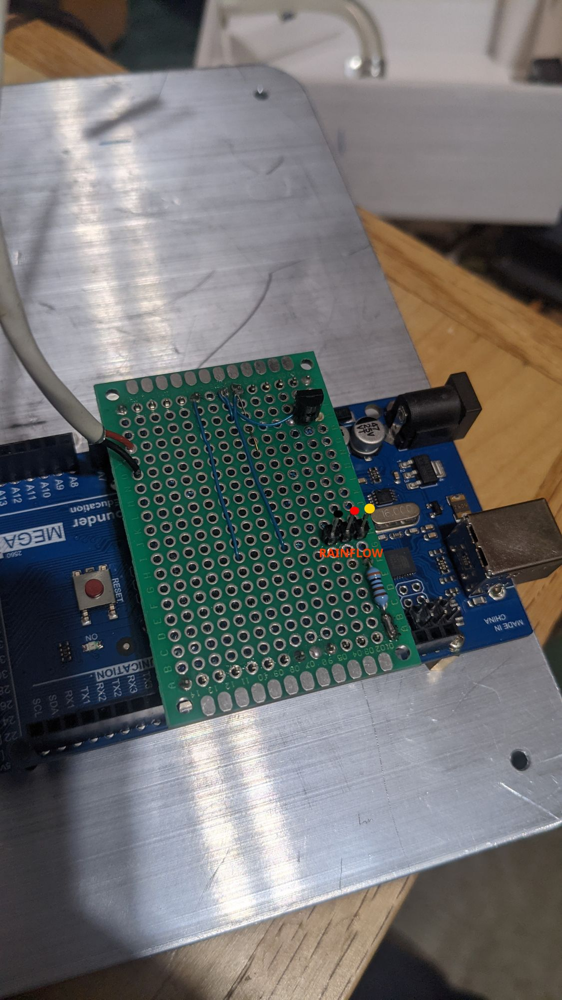
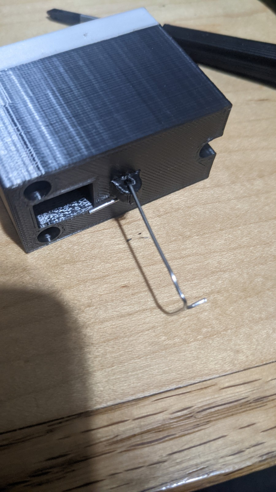

Advanced Service
================

ProtoBoard Pins
###############

Dismantle the Light Sensor Door
###############################

.. note::
  You must remove your CMS's cover before continuining.

.. warning::
  Do not power CMS with lid removed!

Locate the clips on the bottom of the :ref:`Light Sensor Aperture`

.. image:: images/light_sensor_servo_horn.jpg
  :height: 250
  :alt: NAMEME

