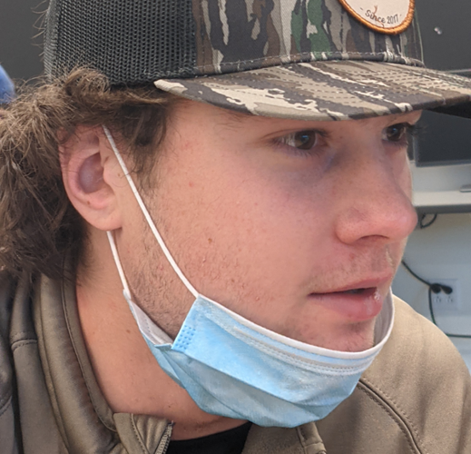
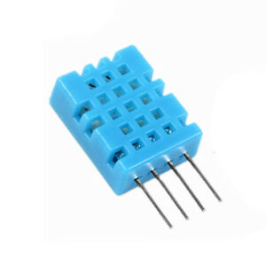
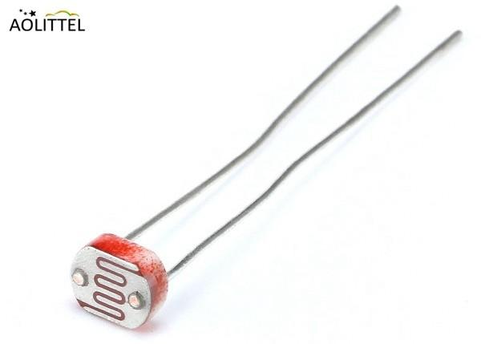
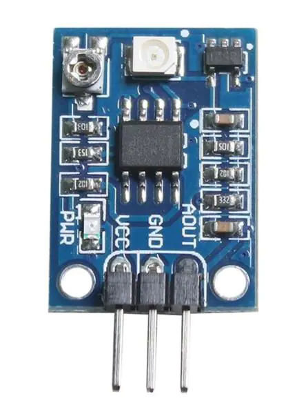
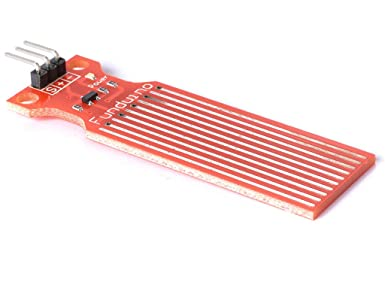
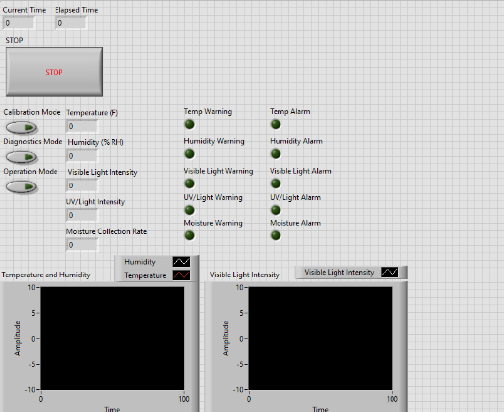
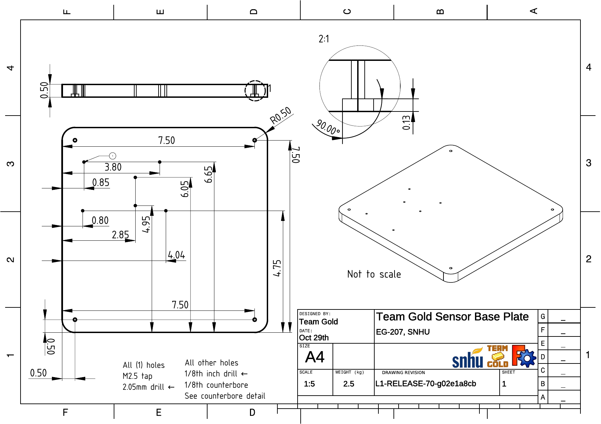
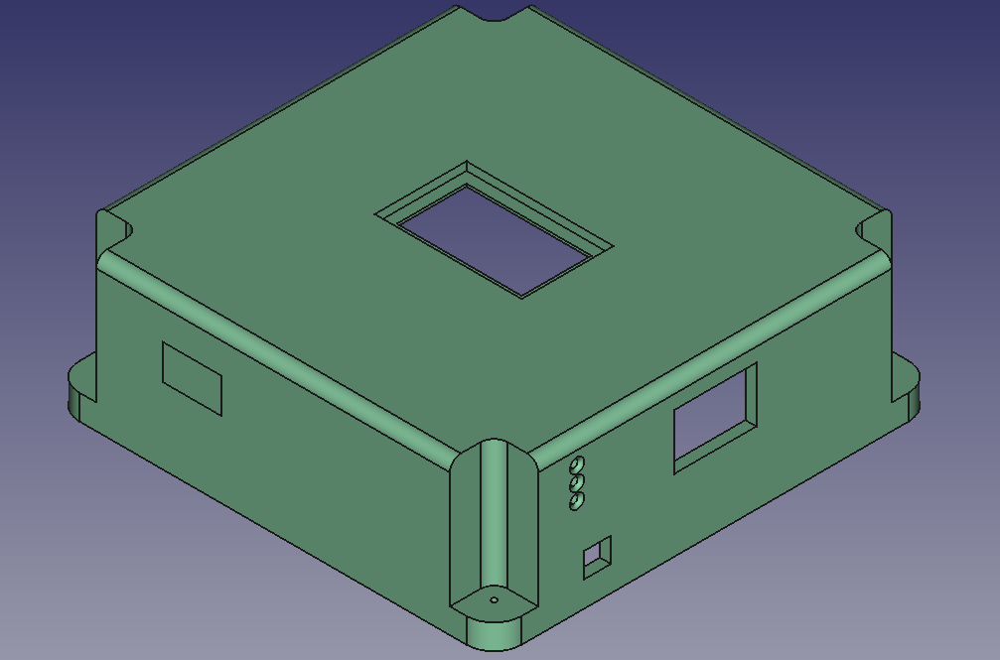
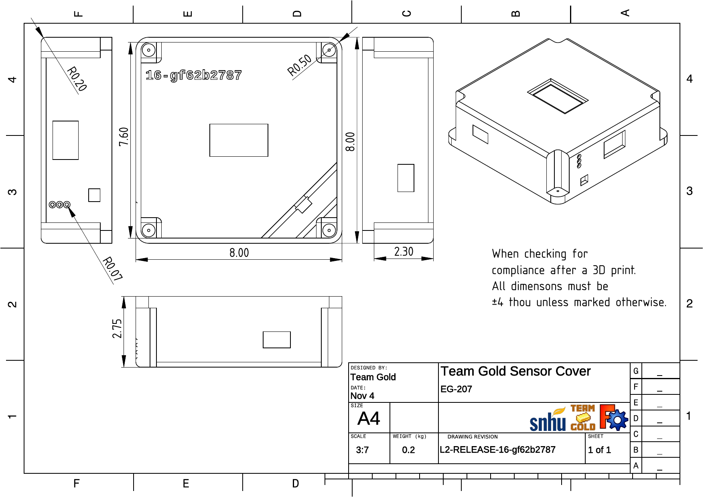

---
title:
 - Team Gold Critical Design Review
subtitle:
 - Version &hash
author:
 - Joe
 - Maria
 - Noah
 - Josh
 - William
institute:
 - SNHU/CETA, EG-207
titlegraphic: resources/SNHU-CETA.png
theme: Ilmenau
navigation: frame
date: "Build Date: &date"
aspectratio: 1610
logo: resources/logo.png
fontsize: 8pt
section-titles: false
toc: false
---

# Introduction

## CDR Agenda

 - Concept of Operations (ConOps) Summary
 - Environmental Systems Description
 - Environmental Sensors
 - Requirement Compliance
 - Front Panel Display, Base-plate and Housing Design Details
 - Summary of Analyses
 - Calibration Plan
 - References/Citations
 - Next Steps

## Concept of Operations (ConOps) Summary

 - Stakeholders
   - We hold some stake in our own system.
   - The completion of our lab is important to those grading it.
 - Users
   - Scientists and Analysts in the field.
 - Operational Description
   - The sensor should be operated indoors and may be left without supervision to collect data and store it.
 - Support Environment
   - Released under the [GNUv3](https://www.gnu.org/licenses/gpl-3.0.en.html) license after final graded release `CMS-1.0-RELEASE` is published, and supported as the license describes, extending absolutely no warranty, and making all source code fully open source.

## Concept of Operations (ConOps) Summary Cont.

 - Use
   - The operator/analyst will use the sensor in the field, and collect data supervised or not.
 - Calibration
   - Calibration data is stored in the EEPROM and the sensor will not require calibration between regular uses, the sensor is not expected to require calibration often but will have a procedure to do so.
 - Impact consideration
   - Because our environmental monitoring solution does not have the same level of quality assurance as a similar solution, over-reliance by the end user could result in uncalibrated data, unexpected failure modes or strange untested bugs over time.
 - Risks
   - Increased risk of the system to malfunction if operation of system is prolonged without proper maintenance.
   - Airborne contaminants can cause the system to malfunction and provide inaccurate data.

## Environmental System Description

::: columns

:::: column

### Functional Block Diagram

{ width=220 }

::::

:::: column

- Instrument: LabVIEW 2019 SP1
- Data Acquisition: Arduino Mega 2560
- DAC Software: Arduino IDE 1.8.15
- Sensors:
  - Temp/RH: DHT11 Sensor
  - Visible Light: CDS55 Photoresistor
  - UV Light: 28091 UV Parallax Sensor
  - Water Collection: DGZZI Water Level Sensor Module

::::

:::

::: notes

This page needs some more work.

:::

## Environmental Sensors & Interfaces

::: columns

:::: {.column width=25%}

{ width=90 }

The DHT 11 is an inexpensive  
serial type thermometer and  
hydrometer.

::::

:::: {.column width=25%}

{ width=90 }

The CDS 55 is a commonly used  
visible light detecting photoresistor.

::::

:::: {.column width=25%}

{ width=90 }

The parallax UV Sensor Breakout  
board is a breakout board  
used in prototypes  
to sense UV Light.

::::

:::: {.column width=25%}

{ width=90 }

It get wet, idk

::::

:::

::: notes

This page needs some more work.

:::

# Requirements

## Functional Requirements - Compliance

| Reqt    | Reqt Title                   | Statement Subject                                       | Reqt Value              | Perf   | Margin | Notes/Basis                  |
|---------|------------------------------|---------------------------------------------------------|-------------------------|--------|--------|------------------------------|
| 3.1.1   | Vi Front Panel               |                                                         |                         |        |        |                              |
| 3.1.1.1 | Sensor Read and Indications  | Numeric Indicators, "Warning" and "Alarm" LEDs          | Provide for all sensors | Comply | N/A    | Physical Indicators as well. |
| 3.1.1.2 | Senors Controls              | Provide necessary controls                              | Arduino Power and STOP  | Comply | N/A    |                              |
| 3.1.1.3 | operation Indications        | Display current system configuration and operating mode | LEDs for Indication     | Comply | N/A    | Physical Indicators as well. |
| 3.1.1.4 | Calibration Updates          | Update Calibration Parameters through LabVIEW           |                         |        |        |                              |
| 3.1.2   | Update/Read Rate             |                                                         |                         |        |        |                              |
| 3.1.3   | Warning and Alarm Indication | Provide warning or alarm indication for each sensor     |                         |        |        |                              |

## Functional Requirements - Compliance Cont.

| Reqt    | Reqt Title       | Statement Subject                                         | Reqt Value            | Perf   | Margin | Notes/Basis |
|---------|------------------|-----------------------------------------------------------|-----------------------|--------|--------|-------------|
| 3.1.3.1 | Temperature      | Provide warning or alarm indication                       | [spec limits go here] | Comply | ±2^-1^ |             |
| 3.1.3.2 | Humidity         | Provide temperature warning or alarm indication           |                       |        |        |             |
| 3.1.3.3 | Visible Light    | Provide temperature warning or alarm indication           |                       |        |        |             |
| 3.1.3.4 | UV Light         | Provide temperature warning or alarm indication           |                       |        |        |             |
| 3.1.3.5 | Water Level      | Provide temperature warning or alarm indication           |                       |        |        |             |
| 3.1.4   | Waveform Display | Display waveform for sensors                              |                       |        |        |             |
| 3.1.5   | Data Logging     | Time-stamped data exported to file with specific filename |                       |        |        |             |
| 3.1.6   | Operational Mode | Provide additional mode                                   |                       |        |        |             |

## Performance Requirements - Compliance

| Reqt. ID or section | Reqt. Title                | Statement Subject                                        | Reqt. Value                   | Performance | Margin | Notes/Basis |
|---------------------|----------------------------|----------------------------------------------------------|-------------------------------|-------------|--------|-------------|
| 3.2.1               | Accuracy                   | Accuracy better than;                                    |                               |             |        |             |
|                     |                            | Temperature                                              | ± 2.5 degrees Celsius         |             |        |             |
|                     |                            | Humidity                                                 | ± 7%                          |             |        |             |
|                     |                            | Vis Illuminance                                          | ± 10 %                        |             |        |             |
|                     |                            | UV Intensity                                             | N/A                           | N/A         | N/A    | N/A         |
|                     |                            | Range detection                                          | ± 1 mm                        |             |        |             |
| 3.2.2               | Precision                  | Precision better than;                                   |                               |             |        |             |
|                     |                            | Temperature                                              | 2 degrees Celsius             |             |        |             |
|                     |                            | Humidity                                                 | 2 %                           |             |        |             |
|                     |                            | Vis Illuminance                                          | 20 Lux                        |             |        |             |
|                     |                            | UV intensity                                             | N/A                           | N/A         | N/A    | N/A         |
|                     |                            | Range detection                                          | 0.2 mm                        |             |        |             |
| 3.2.3               | Calibration or Diagnostics | The display Shall provide ability to update calribration | Update via numerical Controls | Comply      |        |             |

# Prototypes

## Front Panel Display Design (LabVIEW)

::: columns

:::: {.column width=60%}

### LabView Front Panel

{ height=55% }

::::

:::: column

- List
- of
- things
- here
  - idk i use python

::::

:::

::: notes

This page needs some more work.

:::

## Sensor Package Assembly Model

{ width=240 }

::: notes

This page needs some more work.

:::

## Base plate Design Drawing

{ height=240 }

::: notes

This page needs some more work.

:::

## Housing Design - Solid Model

{ height=240 }

::: notes

Have some callouts and stuff for  
important features and cutouts on model.

:::

## Housing Design - Drawing

{ height=240 }

::: notes

Just put the drawing here

:::

# Analyses

## List and Summary of Analyses

::: notes

This page needs some more work.

:::

## Calibration Plan

::: columns

:::: column

### Auto-Calibration

Procedure for undergoing an autocal:

 - When sensor is first powered on, these conditions must be met:
   - Light Sensor door must be closed.
   - Neither Sensor must read an absolute 0 value.
   - There must be no error codes in the error EEPROM location.
   - There must be no warning, or out-of-range codes in the warning EEPROM location.
 - If all conditions are met, the sensor will compare its previous 0 mark to the current readings of the light sensors
   - If they differ:
     - Sensor will average 10 seconds of recording and create a new offset, and store this in the EEPROM
     - Sensor will then allow a user to extend or retract the light sensor door as normal, while also raising a warning code for 50 seconds indicating it has had a recent autocal.
   - If they do not differ:
     - Sensor will not change the value and will not wait 10 seconds or raise a warning code.

::::

:::: column

### Manual Calibration

Neither the water sensor, nor the DHT11 can have an accurate autocal routine, these sensors must be calibrated by the operator via the LabVIEW vi.

 - To calibrate the DHT11
   - The sensor must start in or be in this state:
     - Light Sensor Door closed.
     - No error codes.
     - No out-of-range or warning codes.
   - The operator must specify their own offset values via the VI, and submit them to the sensor with a AUTOCAL tagged packet
   - The sensor will store these offsets in its EEPROM
 - To Calbrate the Water Flow Sensor
   - The operator must meet the state defined for the DHT11 Calibration
   - They can input their own values, or alternativly, select the 'zero' button for the flow sensor, to calibrate in a known dry enviorment.

::::

:::

::: notes

This page needs some more work.

:::

# Appendix

## References/Citations

::: notes

This page needs some more work.

:::

## Next Steps

 - Complete manufactoring of base plate
 - Complete manufatoring of rain bucket
 - Finalize Arduino Code 
 - Construct LabVIEW for all sensors and their environments
 - Configure the wiring from Arduino to the bread board for all sensors

::: notes

:::

# Extra Material

## Team Members

::: columns

:::: {.column width=20%}

{ width=90 }

::::

:::: {.column width=20%}

{ width=90 }

::::

:::: {.column width=20%}

{ width=90 }

::::

:::: {.column width=20%}

{ width=90 }

::::

:::: {.column width=20%}

{ width=90 }

::::

:::
