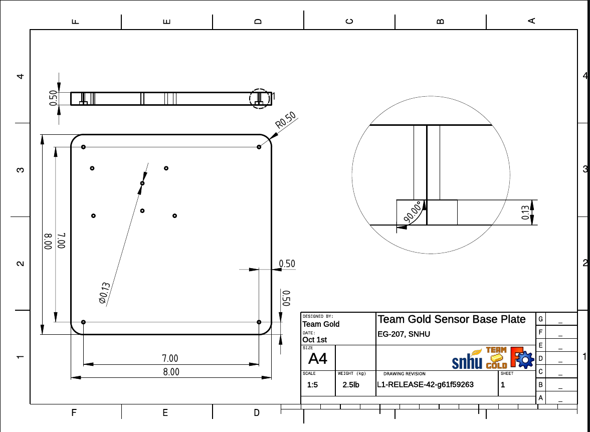

---
title:
 - Team Gold Critical Design Review
subtitle:
 - Version &hash
author:
 - Joe
 - Maria
 - Noah
 - Josh
 - William
institute:
 - SNHU/CETA, EG-207
titlegraphic: resources/SNHU-CETA.png
theme: Ilmenau
navigation: frame
date: "Build Date: &date"
aspectratio: 1610
logo: resources/logo.png
fontsize: 8pt
section-titles: false
toc: false
---

# Introduction

## CDR Agenda

 - Concept of Operations (ConOps) Summary
 - Environmental Systems Description
 - Environmental Sensors
 - Requirement Compliance
 - Front Panel Display, Baseplate and Housing Design Details
 - Summary of Analyses
 - Calibration Plan
 - References/Citations
 - Next Steps

## Concept of Operations (ConOps) Summary

::: notes

This page needs some more work.

:::

## Environmental System Description

::: columns

:::: column

### Functional Block Diagram

{ width=180 }

::::

:::: column

- Instrument: LabVIEW 2019 SP1
- Data Acquisition: Arduino Mega 2560
- DAC Software: Ardunio IDE 1.8.15
- Sensors:
  - Temp/RH: DHT11 Sensor
  - Visible Light: CDS55 Photoresistor
  - UV Light: 28091 UV Parallax Sensor
  - Water Collection: DGZZI Water Level Sensor Module

::::

:::

::: notes

This page needs some more work.

:::

## Environmental Sensors & Interfaces

::: columns

:::: {.column width=25%}

{ width=90 }

The DHT 11 is an inexpensive  
serial type thermometer and  
hydrometer.

::::

:::: {.column width=25%}

{ width=90 }

The CDS 55 is a commonly used  
visible light detecting photoresistor.

::::

:::: {.column width=25%}

{ width=90 }

The parallax UV Sensor Breakout  
board is a breakout board  
used in prototypes  
to sense UV Light.

::::

:::: {.column width=25%}

{ width=90 }

It get wet, idk

::::

:::

::: notes

This page needs some more work.

:::

# Reqirements

## Functional Requiremenets - Compliance

| Reqt    | Reqt Title                   | Statement Subject                                       | Reqt Value | Perf | Margin | Notes/Basis |
|---------|------------------------------|---------------------------------------------------------|------------|------|--------|-------------|
| 3.1.1   | Vi Front Panel               |                                                         |            |      |        |             |
| 3.1.1.1 | Sensor Read and Indications  | Numeric Indicators, "Warning" and "Alarm" LEDs          |            |      |        |             |
| 3.1.1.2 | Senors Controls              | Provide necessary controls                              |            |      |        |             |
| 3.1.1.3 | operation Indications        | Display current system configuration and operating mode |            |      |        |             |
| 3.1.1.4 | Calibration Updates          |                                                         |            |      |        |             |
| 3.1.2   | Update/Read Rate             |                                                         |            |      |        |             |
| 3.1.3   | Warning and Alarm Indication |                                                         |            |      |        |             |
| 3.1.3.1 | Temperature                  |                                                         |            |      |        |             |
| 3.1.3.2 | Humidity                     |                                                         |            |      |        |             |
| 3.1.3.3 | Visible Light                |                                                         |            |      |        |             |
| 3.1.3.4 | UV Light                     |                                                         |            |      |        |             |
| 3.1.3.5 | Water Level                  |                                                         |            |      |        |             |
| 3.1.4   | Waveform Display             |                                                         |            |      |        |             |
| 3.1.5   | Data Logging                 |                                                         |            |      |        |             |
| 3.1.6   | Operational Mode             |                                                         |            |      |        |             |

 ::: notes

This page needs some more work.

:::

# Prototypes

## Front Panel Display Design (LabVIEW)

::: columns

:::: column

### LabView Front Panel

{ width=180 }

::::

:::: column

- List
- of
- things
- here
  - idk i use python

::::

:::

::: notes

This page needs some more work.

:::

## Sensor Package Assembly Model

{ width=240 }

::: notes

This page needs some more work.

:::

## Baseplate Design Drawing

{ width=240 }

::: notes

This page needs some more work.

:::

## Housing Design - Solid Model

{ width=240 }

::: notes

Have some callouts and stuff for  
important features and cutouts on model.

:::

## Housing Design - Drawing

{ width=240 }

::: notes

Just put the drawing here

:::

# Analyses

## List and Summary of Analyses

::: notes

This page needs some more work.

:::

## Calibration Plan

::: notes

This page needs some more work.

:::

# Appendix

## References/Citations

::: notes

This page needs some more work.

:::

## Next Steps

::: notes

This page needs some more work.

:::

# Extra Material

## Backup Slides

{ width=240 }

::: notes

This page needs some more work.

:::
