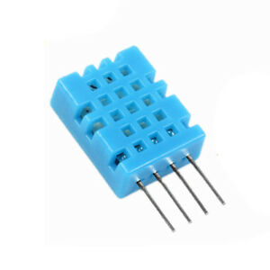

---
title:
 - Team Gold Preliminary Design Review
subtitle:
 - Version &hash
author:
 - Joe
 - Maria
 - Noah
 - Josh
 - William
institute:
 - SNHU/CETA, EG-207
titlegraphic: resources/SNHU-CETA.png
theme: Madrid
navigation: frame
date: "Build Date: &date"
aspectratio: 1610
logo: resources/logo.png
fontsize: 8pt
---

# PDR Agenda

 - Con-Ops Summary
 - Environmental System Description
 - Environmental Sensors
 - Performance Requirements/Compliance
  - Functional
  - Performance
  - Verification
 - Base-plate/Housing Design Concepts
 - Next Steps

# Concept of Operations (Con-Ops) Summary

 - Stakeholders
   - We hold some stake in our own system.
   - The completion of our lab is important to those grading it.
 - Users
   - Scientists and Analysts in the field.
 - Operational Description
   - The sensor should be operated indoors and may be left without supervision to collect data and store it.
 - Support Environment
   - Released under the GNUv3 license after final graded release `CMS-1.0-RELEASE` is published, and supported as the license describes, extending absolutely no warranty.
 - Use
   - The operator/analyst will use the sensor in the field, and collect data supervised or not.
 - Calibration
   - Calibration data is stored in the EEPROM and the sensor will not require calibration between regular uses, the sensor is not expected to require calibration often but will have a procedure to do so.

# Concept of Operations (Con-Ops) Summary Cont.

 - Impact consideration
   - Because our environmental monitoring solution does not have the same level of quality assurance as a similar solution, over-reliance by the end user could result in uncalibrated data, unexpected failure modes or strange untested bugs over time.
 - Risks
   - Increased risk of the system to malfunction if operation of system is prolonged without proper maintenance.
   - Airborne contaminants can cause the system to malfunction and provide inaccurate data.

{ width=22%} { width=25% }

# Environmental System Description

 - Instrument: LabVIEWw 2019
 - Data Acquisition: Arduino AVR (mega)
 - DAC Software: Arduino + pyplot and numpy
 - Sensors:
   - Temp/RH: DHT11
   - UV Light: TBD
   - Visible Light: Photo-resistor

# Environmental Sensors

 - Sensors:
   - Temp/RH: DHT-11
   - Visible Light: CDS-55
   - UV Light: Parallax 28091

{ width=26% }

# Performance Requirements - Compliance

| Reqt  | Owner     | Title                           | Reqt Value           | Perf.           | Margin | Notes/Bias                                                        |
|-------|-----------|---------------------------------|----------------------|-----------------|--------|-------------------------------------------------------------------|
| 3.1.1 | Team Gold | Virtual Instruments Front Panel | Demonstrate, Inspect | Complies        |        |                                                                   |
| 3.1.2 | Team Gold | Sensor Update/Read Rate         | Demonstrate, Inspect | Interrupt Based | ISR    |                                                                   |
| 3.1.3 | Team Gold | Warning and Alarm Indication    | Demonstrate, Test    | Complies        |        | Sensor yellow and red limits and decision-making flow chart req’d |
| 3.1.4 | Team Gold | Waveform Display                | Demonstrate          | Complies        |        |                                                                   |
| 3.1.5 | Team Gold | Data Logging                    | Demonstrate, Inspect | Complies        |        | Data file to be provided in ADP                                   |
| 3.1.6 | Team Gold | Operational Modes               | Demonstrate          | Complies        |        |                                                                   |
| 3.2.1 | Team Gold | Sensor Accuracy                 | Validation           | Characterized   |        | Standard to be used for accuracy determination                    |
| 3.2.2 | Team Gold | Sensor Precision                | Analysis, Validation | Characterized   |        | Standard deviation analysis req’d                                 |
| 3.2.3 | Team Gold | Calibration or Diagnostics      | Demonstration        | Built in        |        |                                                                   |

# Performance Requirements - Compliance Cont.

| Reqt    | Owner     | Title                     | Reqt Value                | Perf.           | Margin    | Notes/Bias                                                            |
|---------|-----------|---------------------------|---------------------------|-----------------|-----------|-----------------------------------------------------------------------|
| 3.3.1   | Team Gold | Mounting                  | Analysis, Demonstration   | Complies        |           |                                                                       |
| 3.3.1.1 | Team Gold | Base-plate Bottom Surface | Demonstration             | Complies        | Flush     |                                                                       |
| 3.3.1.2 | Team Gold | Housing to Base-plate     | Demonstration             | Complies        | Flush     |                                                                       |
| 3.3.2   | Team Gold | Electrical                | Validation, Demonstration | Complies        | Proto     | System Electrical Circuit Diagram req’d (including Arduino functions) |
| 3.3.3   | Team Gold | Data Power and Access     | Demonstration             | Complies        | TTY       |                                                                       |
| 3.4.1   | Team Gold | Housing                   | Validation, Demonstration | Complies        |           | *STL file and outline drawing required for fabrication                |
| 3.4.2   | Team Gold | Base-plate                | Validation                | Complies        |           |                                                                       |
| 3.4.3   | Team Gold | Electrical                | Validation                | Complies        |           |                                                                       |
| 3.4.4   | Team Gold | Hardware                  | Validation, Inspection    | Complies        | Collected |                                                                       |
| 3.5.1   | Team Gold | Team Structure            | Demonstration             | Does Not Comply |           |                                                                       |

# Performance Requirements - Compliance Cont.

| Reqt    | Owner     | Title                     | Reqt Value                | Perf.        | Margin    | Notes/Bias                                                           |
|---------|-----------|---------------------------|---------------------------|--------------|-----------|----------------------------------------------------------------------|
| 3.5.2   | Team Gold | Team Communications       | Demonstration, Inspection | Complies[^1] |           | Weekly email status reports                                          |
| 3.5.3   | Team Gold | PDR and CDR Presentations | Demonstration             | Complies     | Automatic | Presentation templates provided, reviewed class before presentations |
| 3.5.4.1 | Team Gold | System Fabrication        | Demonstration, Inspection | Complies     |           | Base-plate part file/fab drawing and cover STL file/outline drawing  |
| 3.5.4.2 | Team Gold | System Demonstration      | Demonstration             | Complies     |           | Instructor executes final verification activity                      |
| 3.5.5   | Team Gold | System ADP                | Inspection                | Complies     |           | ZIP file of all native files                                         |

[^1]: See our [discord](https://discord.gg/gQ547MBvgA).

# Verification Requirements

| Reqt  | Title                        | Method       | Notes/Bias                                                               |
|-------|------------------------------|--------------|--------------------------------------------------------------------------|
| 3.1   | Functional Requirements      |              |                                                                          |
| 3.1.1 | Virtual Instrument panel     | D[^D], I[^I] | By including it we can demonstrate that we meet this req.                |
| 3.1.2 | Sensor Update/Read Rate      | A[^A], D     | We will use interrupt based frame handling, to avoid 'read rate' issues. |
| 3.1.3 | Warning and Alarm Indication | D, T[^T]     | Sensor and red limits and decision-making flow chart                     |
| 3.1.4 | Waveform Display             | D            |                                                                          |
| 3.1.5 | Data Logging                 | D, I         | Data file to be provided in ADP                                          |
| 3.1.6 | Operational Modes            | D            | The sensor will operate as a state machine, and have transition states   |
| 3.2   | Performance Requirements     |              |                                                                          |
| 3.2.1 | Sensor accuracy              | V[^V]        | Standard to be used for accuracy determination                           |
| 3.2.2 | Sensor Precision             | A, V         | Standard Deviation Analysis                                              |
| 3.2.3 | Calibration Diagnostics      | D            |                                                                          |
| 3.3   | Interface Requirements       |              |                                                                          |
| 3.3.1 | Mounting                     | A, D         |                                                                          |

[^D]: Demonstrate.
[^I]: Inspection.
[^T]: Test.
[^V]: Validation.
[^A]: Analysis.

# Verification Requirements Cont.

| Reqt    | Title                     | Method  | Notes/Bias                                                           |
|---------|---------------------------|---------|----------------------------------------------------------------------|
| 3.3.1.1 | Base-plate Bottom Surface | D[^D]   | Flush mount only!                                                    |
| 3.3.1.2 | Housing to Base-plate     | D       | Screws on mounting corners.                                          |
| 3.3.2   | Electrical                | V[^V],D | System Electrical Circuit Diagram                                    |
| 3.3.3   | Data and power Access     | D       | Utilizing only VRM power (if no more is required)                    |
| 3.4     | Design Requirements       |         |                                                                      |
| 3.4 1   | Housing                   | V,D     | STl file anf outline drawing required for fabrication                |
| 3.4.2   | Base-plate                | V       | Modeled in 3D, manufactured to 2D spec.                              |
| 3.4.3   | Electrical                | V       | Solder and protoboarding                                             |
| 3.4.4.  | Hardware                  | V,I[^I] |                                                                      |
| 3.5     | Project Requirements      |         |                                                                      |
| 3.5.1   | Team Structure            | D       | Unstructured, plans to implement a team leader?                      |
| 3.5.2   | Team Communications       | D,I     | Weekly email status reports                                          |
| 3.5.3   | PDR and CDR Presentations | D       | Presentation templates provided, reviewed class before presentations |
| 3.5.4   | System Fabrication        | D,I     | Base-plate part file/fab/ drawing and cover STL file/outline drawing |
| 3.5.4   | System Demonstration      | D       | Instructor executes final verification activity                      |
| 3.5.5   | System ADP                | I       | ZIP file of all native files                                         |

# Concepts/RC0

## Base Plate

The base plate is ready to machine and has its drawings written up.

# Concepts/RC0 Cont.

## Shell

{ width=38% }

The Upper shell contains all the mounting for each sensor save for the light sensor, witch has its own, actuated housing.

# Concepts/RC0 Cont.

## LabView

{ width=38% }

# Next Steps[^2]

 - Complete RC1 manufacturing on plastic cover
 - Complete prototyping of light sensor housing
 - Machine Base-plate
 - Construct/Finalize VI

[^2]: Next steps copied from kaban, see cards for latest status: [Link](https://github.com/KenwoodFox/EG-207-CCEMS/projects/1)
