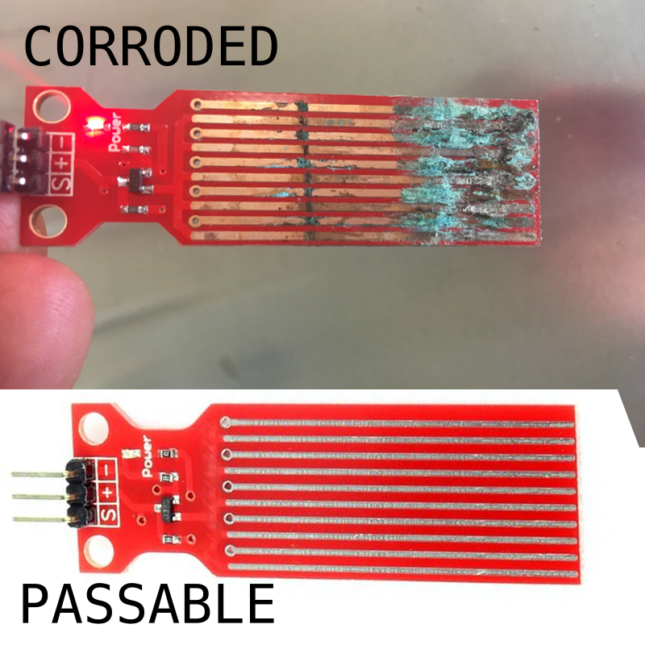

Service
=======

Some parts of your CMS are user servicable, and may require service during normal
operation. The following chart details at what time parts may need to be serviced.

Service Schedule
################

.. list-table:: Service Schedule
   :widths: 50 25 25
   :header-rows: 1

   * - Service
     - Hours
     - Cycles
   * - :ref:`Clean the Rain Flow Sensor`
     - 100hrs
     - N/A
   * - Lubricate Light Sensor
     - 150hrs
     - 600 cycles

Clean the Rain Flow Sensor
##########################

Refer to the :ref:`Service Schedule` to determine when the rain flow sensor should be inspected.

Follow the next steps to properly clean your Rain Flow Sensor.

Start by unscrewing the two screws covering the circuitry of the Rain Flow Sensor.

Next, Unplug and slide the water level sensor out.

Perform a visual inspection, check for debris, corrosion or other iregularities, if the sensor visually looks good, reinstall the sensor and screw the cover back on.

.. warning::

    When reinstalling the service cover, make sure to properly re-install the small gasket found between the two parts.

    .. image:: ../presentations/resources/logo.png
        :height: 150
        :alt: Rainflow Service Cover Gasket
