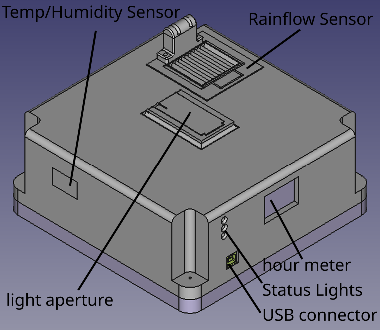

Getting Started
===============

Introduction
------------

The *Climate Monitoring System* by **Team Gold** is a fully featured scientific climate monitoring instrument,
designed to provide the user with the ability to catalog and record the changes in an outdoor environment over
a period of time.

.. warning::
    Before plugging in your CMS please read :ref:`Light Sensor Aperture` first. Failure to do so may put you
    at risk of damaging your CMS.

Hardware
--------

The CMS is an enclosed unit designed to provide you the user with the ability to record and catalog several
scientific metrics at once. By placing the CMS in some environment, you can record the changes that environment
undergoes over time.

Physical Features
^^^^^^^^^^^^^^^^^

USB Connector
^^^^^^^^^^^^^

Your CMS comes equipped with a USB type B connector, used for plugging your sensor into a laptop, desktop or embedded
system.

Light Sensor Aperture
^^^^^^^^^^^^^^^^^^^^^

The light sensor Aperture is a component of your CMS used to catalog and sense the presence and intensity of both *UV Light*
as well as *Visible Light*.

.. warning::
    Please be aware, the :ref:`Light Sensor Aperture` may move upon startup, please confirm the following on your sensor
    before turning it on for the first time.

    - Your :ref:`Light Sensor Aperture` is closed and or fully open
    - The space around your :ref:`Light Sensor Aperture` is free of objects or hazards

Temp/Humidity Opening
^^^^^^^^^^^^^^^^^^^^^

The opening on the rear left corner of the CMS allows for air to flow through an internal channel and be read by the sensor within
it is important that this covering is free of debris and is not at risk of collecting debris, especially outdoors.

.. note::
    Your CMS may have come with masking tape covering the sensor opening, it is important to remove this tape before placing the
    sensor into service.

Rainflow Sensor
^^^^^^^^^^^^^^^

Your CMS can record rainflow in in :sup:`3`/min OR Inches of Rain/Rainfall. You can set the output mode in the LabView :ref:`Software`.

Software
--------

To use the full feature set of your CMS, you must configure the CMS companion software that ships with your sensor.
There are multiple ways to acquire this software, the recommended way is :ref:`With a Release`, but other options exist.

With a Release
^^^^^^^^^^^^^^

By using a specific release, you can be sure that a specific release behaves as its corresponding documentation or for a specific
hardware version, to begin, navigate to the online Releases_ page on github, and follow the instructions to install attached to the
latest release.

Using your sensor
-----------------

Once you've collected your *Climate Monitoring System* and configured your software, proceed to the :ref:`Normal Use`
section to learn how to use your sensor.

.. _Releases: https://github.com/KenwoodFox/EG-207-CCEMS/releases/
