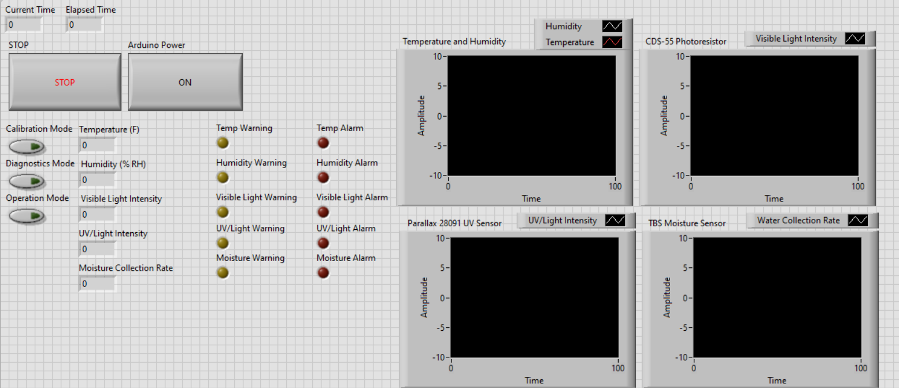

Normal Use
==========

Using the LabView Interface
###########################

Much of the climate monitoring system uses the LabView Interface (link here) shipped with the sensor as software.

The LabView front panel allows the user to do all tasks related to the upkeep and function of the sensor.

Errors, Warnings and Alarms
###########################

When the limits of :ref:`Normal Use` are exceeded, your CMS may raise an :ref:`Error`, send a :ref:`Warning`, or raise an :ref:`Alarm`.

Limits
------

.. list-table:: Sensor Limits
   :widths: 50 25 25
   :header-rows: 1

   * - Sensor
     - Warning
     - Alarm
   * - Water Flow Sensor
     - less than 0.5in
     - (Slightly under 'flow over' max)

doot

Error
-----

An error is an issue with the sensor overseer system, examples of error are things like the light sensor door being unable to
open, a disconnect in a sensor, a USB reset or a filesystem error on the laptop. Errors when raised are stored in the EEPROM,
and can be read out via the LabView interface.

Warning
-------

A warning is triggered by a sensor approaching some known limit or by some other function of the system approaching a limit or max.
Examples include UV radiation in excess of normal values, a firmware upgrade being halted, or a failed sensor autocal. They are read
from the EEPROM and can be displayed via the LabView interface.

Alarm
-----

An alarm code is raised when a sensor exceeds safe ranges for operation, for example, UV radiation that may damage the sensor, extreme
heat that could overwhelm the DHT11's paper components, or a water leve/submersion that may overcome the foam and rubber gaskets of the
sensor housing.

When an alarm code is rasied, its value is stored in EEPROM, and, if possible, "Evasive Measures" are taken to protect the sensor, such as:

 - Shutting down individual sensor power
 - Closing the light sensor door
 - Triggering a USB reset
