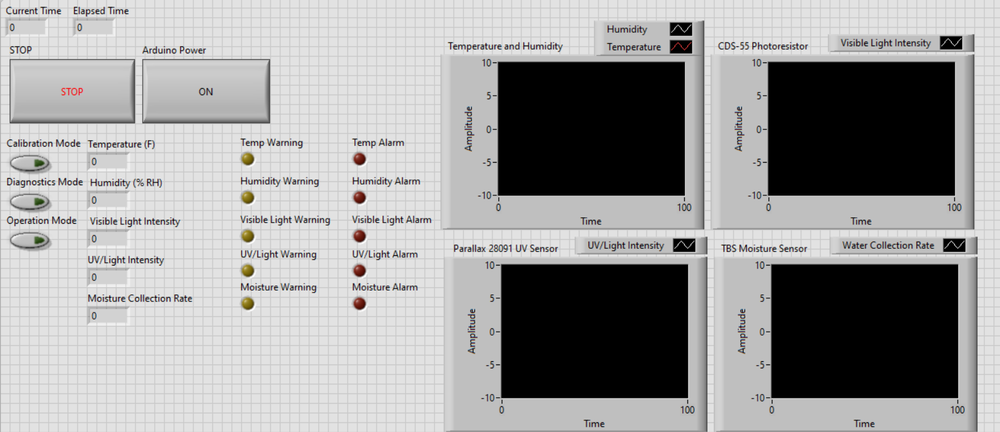

Usage
=====

Using the LabView Interface
###########################

Much of the climate monitoring system uses the LabView Interface (link here) shipped with the sensor as software.

The LabView front panel allows the user to do all tasks related to the upkeep and function of the sensor.
